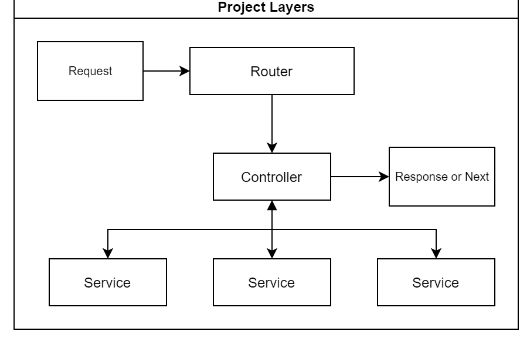

# Express Rest API Server Boilerplate
[](https://www.codacy.com?utm_source=github.com&amp;utm_medium=referral&amp;utm_content=TrevorN1126/express-sequelize-rest-api-server&amp;utm_campaign=Badge_Grade)
**This project is a work in progress**
## Overview
This is a boilerplate application for building REST APIs with Express, Mongoose, permission based JWT Authentication and Mocha tests.
Created with attempting to follow [Node.js Best Practices](https://github.com/goldbergyoni/nodebestpractices) as closely as possible.

## Features
| Feature | Summary |
|---------|---------|
| Authentication via JsonWebToken | Supports authentication using [jsonwebtoken](https://www.npmjs.com/package/jsonwebtoken). |
| Code Linting | JavaScript code linting is done using [ESLint](http://eslint.org) - a pluggable linter tool for identifying and reporting on patterns in JavaScript. Uses ESLint with [eslint-config-airbnb](https://github.com/airbnb/javascript/tree/master/packages/eslint-config-airbnb), which tries to follow the Airbnb JavaScript style  guide. |
| Auto server restart | Restart the server using [nodemon](https://github.com/remy/nodemon) in real-time anytime an edit is made, with babel compilation and eslint. |
| Debugging via [debug](https://www.npmjs.com/package/debug) | Instead of inserting and deleting console.log you can replace it with the debug function and just leave it there. You can then selectively debug portions of your code by setting DEBUG env variable. If DEBUG env variable is not set, nothing is displayed to the console. |
| API parameter validation via [express-validation](https://www.npmjs.com/package/express-validation) | Validate body, params, query, headers and cookies of a request (via middleware) and return a response with errors; if any of the configured validation rules fail. You won't anymore need to make your route handler dirty with such validations. |
| Pre-commit hooks | Runs lint and tests before any commit is made locally, making sure that only tested and quality code is committed |
| Secure app via [helmet](https://github.com/helmetjs/helmet) | Helmet helps secure Express apps by setting various HTTP headers. |
| Uses [yarn](https://yarnpkg.com) over npm | Uses new released yarn package manager by facebook. You can read more about it [here](https://code.facebook.com/posts/1840075619545360) |
| CORS support via [cors](https://github.com/expressjs/cors) | fasdfasdfasdfdsdasfsdfasdfasdfasdf |
| Uses [http-status](https://www.npmjs.com/package/http-status) to set http status codes | fasdfasdfasdfdsdasfsdfasdfasdfasdf |
| Generated documentation using [jsdocs]() | fasdfasdfasdfdsdasfsdfasdfasdfasdf |
| Has `.editorconfig` | which helps developers define and maintain consistent coding styles between different editors and IDEs. |
| Uses mocha |  |


## Getting Started
Clone the repo:
```sh
git clone https://github.com/TrevorN1126/express-sequelize-rest-api-server.git
cd express-sequelize-rest-api-server
```

Install yarn:
```js
npm install -g yarn
```

Install dependencies:
```sh
yarn
```

Set environment (vars):
```sh
cp .env.example .env
```

**Make sure the database server is running**

Create datbases
```sh
npx sequelize-cli db:create
```

Create db tables
```sh
npx sequelize-cli db:migrate
```

Seed db tables
```sh
npx sequelize-cli db:seed:all
```

Start server:
```sh
# Start server
yarn start

# start server with nodemon
yarn start-dev

# Selectively set DEBUG env var to get logs
DEBUG=express-sequelize-rest-api-server:* yarn start
```
Refer [debug](https://www.npmjs.com/package/debug) to know how to selectively turn on logs.


### Tests:
```sh
# Run tests written in ES6
yarn test

# Run tests on file change
yarn test:watch

# Run test coverage
yarn test:coverage

```

### Lint:
```sh
# Lint code with ESLint
yarn lint

# Run lint on any file change
yarn lint:watch
```

### Deployment:
```sh
# compile to ES5
1. yarn build

# upload dist/ to your server
2. scp -rp dist/ user@dest:/path

# install production dependencies only
3. yarn --production

```

## Project Structure

### Layered Component based
Folders under the /server directory are organized into self-contained components that don't share files with others, each constitutes very few files (e.g. models, routes, controllers, services, test, etc.) so that it's very easy to reason about it. This not only draws a clean separation of concerns but also significantly eases mocking and testing the system.



component/component.route.js
: Uses an `express.Router()` to define the endpoint, register middleware and then calls the component controller

component/component.controller.js
: Sets up any req variables, then calls the services and handles the res back to the route

component/component.service.js
: Handles any business logic or db calls

component/tests/component.route.test.js
: Defines all tests for the routes

component/tests/component.service.test.js
: Defines all tests for the Component service

```bash
├── server/
│   ├── component/
│       ├── component.controller.js
│       ├── component.route.js
│       ├── component.service.js
│           ├── tests/
│               ├── component.route.test.js
│               ├── component.service.test.js
└──
```

## Routes
**Full route documentation can be found in the /docs folder**

Protected Routes require a jwt header to access and the listed permission on the user
Header: Authorization - Bearer {token}

### Auth
#### /api/auth/
*   POST /api/auth/login - Returns token if correct username and password is provided
*   GET /api/auth/random-number - Example route that return a random number **protected route** (no permission required)

### User
#### /api/users
*   GET /api/users - Get list of users **protected route** (admin permission required)
*   POST /api/users - Create new user **protected route** (admin permission required)

#### /api/users/:userId
*   GET /api/users/:userId - Get user **protected route** (admin permission required)
*   PUT /api/users/:userId - Update user **protected route** (admin permission required)
*   DELETE /api/users/:userId - Delete user **protected route** (admin permission required)

### Thing
#### /api/things
*   GET /api/things - Get list of things **public route** (no permission required)
*   POST /api/things - Create new thing **protected route** (admin or user permission required)

#### /api/things/:thingId
*   GET /api/things/:thingId - Get thing **public route** (no permission required)
*   PUT /api/things/:thingId - Update thing **protected route** (admin permission required)
*   DELETE /api/things/:thingId - Delete thing **protected route** (admin permission required)

## Logging
Universal logging library [winston](https://www.npmjs.com/package/winston) is used for logging. It has support for multiple transports.  A transport is essentially a storage device for your logs. Each instance of a winston logger can have multiple transports configured at different levels. For example, one may want error logs to be stored in a persistent remote location (like a database), but all logs output to the console or a local file. We just log to the console for simplicity, you can configure more transports as per your requirement.

#### API logging
Logs detailed info about each api request to console during development.

#### Error logging
Logs stacktrace of error to console along with other details.

## Contributing
For code contributions submit a pull request along with tests.

## License
This project is licensed under the MIT License
